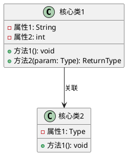
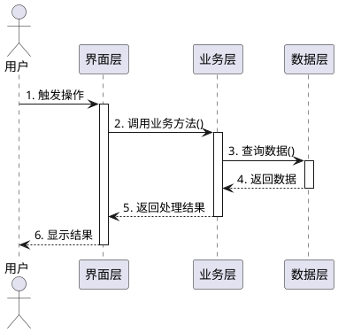

# 考核报告2：个人报告
*移动应用开发综合项目考核 - 个人贡献报告*

---

## ⚠️ 重要提示

**🔴 四份报告必须全部提交（否则0分）**：
- **考核报告1：答辩报告**（演示答辩）
- **考核报告2：个人报告**（个人工作总结，本报告）
- **考核报告3：小组报告**（团队协作总结）
- **考核报告4：项目报告**（技术文档）
- ⚠️ **缺少任何一份报告，大作业成绩为0分（占课程总成绩50%）**
- ⚠️ **迟交任何一份报告，按缺交处理，成绩0分**

---

**🔴 关键考核指标（不规范此环节0分）**：

本报告必须包含以下三类规范的技术图表，这是重点考核指标，也是答辩的必答题内容：

1. **系统核心类图（UML Class Diagram）** - 必须
2. **核心功能顺序图（UML Sequence Diagram）** - 必须  
3. **系统架构图（Architecture Diagram）** - 必须

**❌ 图表不规范的判定标准**：
- 图表缺失或不完整
- 不符合UML规范（类图、顺序图）
- 图表与实际代码不符
- 图表模糊不清或无法识别
- 缺少必要的标注和说明

**✅ 图表规范要求**：详见本报告"必须提交的技术图表"章节

**⭐ 提示**：
- 推荐使用工具：PlantUML、EA、StarUML、Visual Paradigm
- 可以直接从代码生成（IDE插件）
- 必须清晰标注类名、方法名、关系、时序
- 图表必须与个人负责模块相关

---

## 📋 个人基本信息

**学生信息**：
- **姓名**：_______________
- **学号**：_______________
- **班级**：_______________
- **专业**：_______________
- **联系方式**：_______________
- **邮箱**：_______________

**项目信息**：
- **项目名称**：_______________
- **团队编号**：_______________
- **团队成员**：_______________ （共___人）
- **项目周期**：_____ 天（___年___月___日 至 ___年___月___日）

**个人角色定位**：
- □ 项目经理
- □ 技术负责人
- □ 前端开发工程师
- □ 后端开发工程师
- □ 测试工程师
- □ UI/UX设计师
- □ 其他：_______________

---

## 🎯 个人负责技术栈

### 技术栈选择

**主要技术栈**：_______________ （如：Android原生、iOS原生、Flutter、React Native、鸿蒙、微信小程序等）

**技术栈详情**：

| 技术类别 | 具体技术 | 熟练程度 | 在项目中的应用 |
|---------|---------|---------|-------------|
| 开发语言 |         | □精通 □熟练 □了解 |             |
| UI框架 |         | □精通 □熟练 □了解 |             |
| 状态管理 |         | □精通 □熟练 □了解 |             |
| 网络库 |         | □精通 □熟练 □了解 |             |
| 本地存储 |         | □精通 □熟练 □了解 |             |
| 第三方库 |         | □精通 □熟练 □了解 |             |

### 技术栈介绍

**技术栈特点**：
_______________________________________________________________
_______________________________________________________________

**选择理由**：
1. _______________________________________________________________
2. _______________________________________________________________
3. _______________________________________________________________

**技术优势**：
- **性能**：_______________
- **开发效率**：_______________
- **生态系统**：_______________
- **社区支持**：_______________

**技术挑战**：
_______________________________________________________________
_______________________________________________________________

---

## 📐 必须提交的技术图表（重点考核）

> **⚠️ 警告**：以下三类图表为答辩必答内容，任何图不规范，此环节为0分！

### 1. 系统核心类图（UML Class Diagram）⭐⭐⭐

**图表要求**：
- 必须绘制个人负责模块的核心类图
- 必须符合UML类图规范
- 必须包含至少3-5个核心类
- 必须标注类之间的关系（继承、实现、关联、依赖、聚合、组合）

**类图必须包含的元素**：
```
类图示例（请使用标准UML工具绘制）：

┌─────────────────────────────┐
│     <<类名>>                  │
├─────────────────────────────┤
│ - 私有属性: 类型              │
│ + 公有属性: 类型              │
├─────────────────────────────┤
│ + 公有方法(参数): 返回类型     │
│ - 私有方法(参数): 返回类型     │
└─────────────────────────────┘
```

**关系符号要求**：
- 继承：实线+空心三角箭头
- 实现：虚线+空心三角箭头
- 关联：实线+箭头
- 依赖：虚线+箭头
- 聚合：实线+空心菱形
- 组合：实线+实心菱形

**个人负责模块核心类图**：

（在此粘贴或插入核心类图，建议使用PlantUML、EA、StarUML等工具绘制）

**PlantUML代码示例**（可选）：


**类图说明**：
- **核心类列表**：
  1. 类名1 - 作用：_______________
  2. 类名2 - 作用：_______________
  3. 类名3 - 作用：_______________
  
- **类之间关系说明**：
  _______________________________________________________________
  _______________________________________________________________

- **设计模式应用**（如有）：
  _______________________________________________________________

---

### 2. 核心功能顺序图（UML Sequence Diagram）⭐⭐⭐

**图表要求**：
- 必须绘制至少1个核心功能的顺序图
- 必须符合UML顺序图规范
- 必须清晰展示对象间的交互时序
- 必须包含参与者、对象、消息、生命线

**顺序图必须包含的元素**：
- 参与者（Actor）：用户或外部系统
- 对象（Object）：参与交互的类实例
- 生命线（Lifeline）：对象存在的时间线
- 消息（Message）：对象间的调用
- 激活框（Activation）：方法执行期间

**顺序图示例结构**：
```
参与者       对象A       对象B       对象C
  |           |           |           |
  |--消息1--> |           |           |
  |           |--消息2--> |           |
  |           |           |--消息3--> |
  |           |           |<--返回3-- |
  |           |<--返回2-- |           |
  |<--返回1-- |           |           |
```

**核心功能1顺序图**：

**功能名称**：_______________

（在此粘贴或插入顺序图）

**PlantUML代码示例**（可选）：


**顺序图说明**：
- **功能描述**：_______________________________________________________________
- **交互步骤说明**：
  1. 步骤1：_______________
  2. 步骤2：_______________
  3. 步骤3：_______________
  4. ...

- **关键技术点**：
  _______________________________________________________________

---

**核心功能2顺序图**（如有）：

**功能名称**：_______________

（在此粘贴或插入顺序图）

**顺序图说明**：
_______________________________________________________________

---

### 3. 系统架构图（Architecture Diagram）⭐⭐⭐

**图表要求**：
- 必须绘制个人负责模块的架构图
- 必须展示分层结构（如MVC、MVVM、分层架构等）
- 必须标注各层的职责和交互
- 必须体现技术栈选型

**架构图必须包含的内容**：
- 表现层（UI层）
- 业务逻辑层
- 数据访问层
- 各层使用的技术/框架
- 层间数据流向

**个人负责模块架构图**：

（在此粘贴或插入架构图）

**架构图示例**：
```
┌─────────────────────────────────────┐
│         表现层 (UI Layer)            │
│   技术：_______________              │
│   职责：用户交互、界面展示            │
└──────────────┬──────────────────────┘
               │ 数据流
               ↓
┌─────────────────────────────────────┐
│      业务逻辑层 (Business Layer)     │
│   技术：_______________              │
│   职责：业务规则、数据处理            │
└──────────────┬──────────────────────┘
               │ 数据流
               ↓
┌─────────────────────────────────────┐
│      数据访问层 (Data Layer)         │
│   技术：_______________              │
│   职责：数据存储、数据同步            │
└─────────────────────────────────────┘
```

**架构说明**：

**采用的架构模式**：_______________（如：MVVM、MVP、MVC、Clean Architecture等）

**各层详细说明**：

**表现层（UI Layer）**：
- **使用技术**：_______________
- **主要组件**：_______________
- **职责**：_______________

**业务逻辑层（Business Layer）**：
- **使用技术**：_______________
- **主要组件**：_______________
- **职责**：_______________

**数据访问层（Data Layer）**：
- **使用技术**：_______________
- **主要组件**：_______________
- **职责**：_______________

**数据流说明**：
_______________________________________________________________
_______________________________________________________________

**架构优势**：
1. _______________________________________________________________
2. _______________________________________________________________
3. _______________________________________________________________

---

### 图表绘制工具推荐

**UML工具**：
- ✅ **PlantUML**（推荐，代码生成图表）
  - 在线编辑器：http://www.plantuml.com/plantuml/
  - VS Code插件：PlantUML
  
- ✅ **EA (Enterprise Architect)**（专业UML工具）
  - 官网：https://sparxsystems.com/
  - 功能强大，支持完整UML规范
  
- ✅ **StarUML**（专业UML工具）
  - 官网：https://staruml.io/
  
- ✅ **Visual Paradigm**（企业级）
  - 官网：https://www.visual-paradigm.com/

**IDE插件**（自动生成）：
- Android Studio：UML插件
- IntelliJ IDEA：UML Support
- VS Code：PlantUML插件
- Xcode：第三方UML工具

**图表提交要求**：
- ✅ 图片格式：PNG或JPG，分辨率不低于1920×1080
- ✅ 清晰度：文字和线条必须清晰可见
- ✅ 完整性：图表完整，不能截断
- ✅ 规范性：符合UML或架构图绘制规范
- ✅ PlantUML代码（可选）：如使用PlantUML，请同时提供代码

---

## 📅 第一阶段：项目启动（第1-3天）

### 个人参与工作

**工作描述**：
在项目启动阶段，我主要负责：
1. _______________________________________________________________
2. _______________________________________________________________
3. _______________________________________________________________

### 具体完成任务

**第1天工作**：
- [ ] 任务1：_______________
  - 完成情况：_______________
  - 工时：_____ 小时
  
- [ ] 任务2：_______________
  - 完成情况：_______________
  - 工时：_____ 小时

**第2天工作**：
- [ ] 任务1：_______________
  - 完成情况：_______________
  - 工时：_____ 小时
  
- [ ] 任务2：_______________
  - 完成情况：_______________
  - 工时：_____ 小时

**第3天工作**：
- [ ] 任务1：_______________
  - 完成情况：_______________
  - 工时：_____ 小时
  
- [ ] 任务2：_______________
  - 完成情况：_______________
  - 工时：_____ 小时

### 个人技术准备

**开发环境搭建**：
- **IDE/编辑器**：_______________（版本：_______）
- **SDK/框架**：_______________（版本：_______）
- **依赖库安装**：_______________
- **AI工具配置**：
  - □ GitHub Copilot（版本：_______）
  - □ TRAE（版本：_______）
  - □ 其他：_______________

**技术方案设计**：
- **架构模式**：_______________
- **设计模式**：_______________
- **代码规范**：_______________

### 架构设计贡献

**参与的架构设计**：
_______________________________________________________________
_______________________________________________________________

**个人提出的方案**：
_______________________________________________________________
_______________________________________________________________

**采纳情况**：
- □ 完全采纳
- □ 部分采纳
- □ 未采纳（原因：_______________）

### 本阶段成果

**交付物**：
1. _______________（如：技术方案文档）
2. _______________（如：环境配置脚本）
3. _______________（如：初始代码框架）

**代码统计**：
- **代码行数**：_____ 行
- **提交次数**：_____ 次
- **Git Commit**：_______________

---

## 💻 第二阶段：核心开发（第4-7天）

### 个人开发工作

**负责的功能模块**：

**模块1：_______________**
- **功能描述**：_______________________________________________________________
- **技术难度**：□ 高 □ 中 □ 低
- **开发时间**：_____ 小时
- **完成度**：_____ %

**模块2：_______________**
- **功能描述**：_______________________________________________________________
- **技术难度**：□ 高 □ 中 □ 低
- **开发时间**：_____ 小时
- **完成度**：_____ %

**模块3：_______________**（如适用）
- **功能描述**：_______________________________________________________________
- **技术难度**：□ 高 □ 中 □ 低
- **开发时间**：_____ 小时
- **完成度**：_____ %

### 开发过程记录

**第4天开发**：
```
日期：_______________
工作时间：_____ 小时

完成内容：
1. _______________
2. _______________
3. _______________

遇到问题：
- 问题1：_______________
  解决方案：_______________
  耗时：_____ 小时

代码提交：
- Commit: _______________
- 代码行数：+_____ -_____
```

**第5天开发**：
```
日期：_______________
工作时间：_____ 小时

完成内容：
1. _______________
2. _______________
3. _______________

遇到问题：
- 问题1：_______________
  解决方案：_______________
  耗时：_____ 小时

代码提交：
- Commit: _______________
- 代码行数：+_____ -_____
```

**第6天开发**：
```
日期：_______________
工作时间：_____ 小时

完成内容：
1. _______________
2. _______________
3. _______________

遇到问题：
- 问题1：_______________
  解决方案：_______________
  耗时：_____ 小时

代码提交：
- Commit: _______________
- 代码行数：+_____ -_____
```

**第7天开发**：
```
日期：_______________
工作时间：_____ 小时

完成内容：
1. _______________
2. _______________
3. _______________

中期检查准备：
_______________

代码提交：
- Commit: _______________
- 代码行数：+_____ -_____
```

### 核心代码实现

**代码片段1：核心功能实现**
```
语言：_______________
功能：_______________

（贴出关键代码，30-50行）
```

**代码说明**：
- **实现思路**：_______________________________________________________________
- **技术要点**：_______________________________________________________________
- **创新之处**：_______________________________________________________________

---

**代码片段2：技术难点突破**
```
语言：_______________
功能：_______________

（贴出关键代码）
```

**代码说明**：
- **技术挑战**：_______________________________________________________________
- **解决方案**：_______________________________________________________________
- **实现效果**：_______________________________________________________________

### AI工具使用记录

**GitHub Copilot使用**：
- **使用频率**：□ 频繁 □ 经常 □ 偶尔
- **主要用途**：
  1. _______________
  2. _______________
  3. _______________
- **效率提升**：_____ %
- **代码质量**：□ 提升明显 □ 有所提升 □ 无明显变化

**TRAE使用**：
- **使用频率**：□ 频繁 □ 经常 □ 偶尔
- **主要用途**：
  1. _______________
  2. _______________
  3. _______________
- **效率提升**：_____ %
- **使用心得**：_______________________________________________________________

### 代码质量保证

**单元测试**：
- **测试用例数**：_____ 个
- **测试覆盖率**：_____ %
- **通过率**：_____ %

**代码审查**：
- **审查次数**：_____ 次
- **发现问题**：_____ 个
- **修复问题**：_____ 个

**代码规范**：
- **Linter检查**：_____ 个警告/错误
- **代码注释率**：_____ %
- **命名规范性**：□ 优秀 □ 良好 □ 一般

### 本阶段成果

**功能完成情况**：
- **计划功能数**：_____ 个
- **实际完成**：_____ 个
- **完成率**：_____ %

**代码统计**：
- **新增代码**：_____ 行
- **修改代码**：_____ 行
- **删除代码**：_____ 行
- **净增代码**：_____ 行
- **Git提交**：_____ 次

**交付物**：
1. _______________
2. _______________
3. _______________

---

## 🔗 第三阶段：系统整合（第8-12天）

### 系统整合工作

**个人负责的整合任务**：
1. _______________________________________________________________
2. _______________________________________________________________
3. _______________________________________________________________

### 整合方法和步骤

**整合方案设计**：
_______________________________________________________________
_______________________________________________________________
_______________________________________________________________

**具体实施步骤**：

**步骤1：接口对接**
- **任务描述**：_______________
- **实施方法**：_______________
- **遇到问题**：_______________
- **解决方案**：_______________
- **完成时间**：第___天
- **工时**：_____ 小时

**步骤2：数据同步**
- **任务描述**：_______________
- **实施方法**：_______________
- **遇到问题**：_______________
- **解决方案**：_______________
- **完成时间**：第___天
- **工时**：_____ 小时

**步骤3：功能联调**
- **任务描述**：_______________
- **实施方法**：_______________
- **遇到问题**：_______________
- **解决方案**：_______________
- **完成时间**：第___天
- **工时**：_____ 小时

**步骤4：性能优化**
- **任务描述**：_______________
- **实施方法**：_______________
- **优化效果**：_______________
- **完成时间**：第___天
- **工时**：_____ 小时

### 跨平台整合实现

**与其他平台的对接**：

**对接平台1：_______________**
- **对接方式**：_______________
- **数据格式**：_______________
- **同步机制**：_______________
- **测试结果**：□ 成功 □ 部分成功 □ 失败

**对接平台2：_______________**
- **对接方式**：_______________
- **数据格式**：_______________
- **同步机制**：_______________
- **测试结果**：□ 成功 □ 部分成功 □ 失败

### 性能优化工作

**优化项目1：启动速度**
- **优化前**：_____ 秒
- **优化后**：_____ 秒
- **优化方法**：_______________
- **优化效果**：提升_____ %

**优化项目2：内存占用**
- **优化前**：_____ MB
- **优化后**：_____ MB
- **优化方法**：_______________
- **优化效果**：降低_____ %

**优化项目3：_______________**
- **优化前**：_______________
- **优化后**：_______________
- **优化方法**：_______________
- **优化效果**：_______________

### 整合过程遇到的困难

**困难1：_______________**
- **问题描述**：_______________________________________________________________
- **影响程度**：□ 严重 □ 一般 □ 轻微
- **解决思路**：_______________________________________________________________
- **最终方案**：_______________________________________________________________
- **解决时间**：_____ 小时
- **经验教训**：_______________________________________________________________

**困难2：_______________**
- **问题描述**：_______________________________________________________________
- **影响程度**：□ 严重 □ 一般 □ 轻微
- **解决思路**：_______________________________________________________________
- **最终方案**：_______________________________________________________________
- **解决时间**：_____ 小时
- **经验教训**：_______________________________________________________________

### 本阶段成果

**整合完成度**：_____ %

**代码统计**：
- **新增代码**：_____ 行
- **修改代码**：_____ 行
- **代码优化**：_____ 处
- **Git提交**：_____ 次

**交付物**：
1. _______________
2. _______________
3. _______________

---

## ✅ 第四阶段：测试交付（第13-15天）

### 测试工作

**个人负责的测试任务**：
1. _______________________________________________________________
2. _______________________________________________________________
3. _______________________________________________________________

### 测试用例设计

**测试用例1**：
```
用例编号：TC-001
用例名称：_______________
测试目的：_______________
前置条件：_______________
测试步骤：
1. _______________
2. _______________
3. _______________
预期结果：_______________
实际结果：_______________
测试结果：□ 通过 □ 失败
Bug编号：_______________（如有）
```

**测试用例2**：
```
用例编号：TC-002
用例名称：_______________
测试目的：_______________
前置条件：_______________
测试步骤：
1. _______________
2. _______________
3. _______________
预期结果：_______________
实际结果：_______________
测试结果：□ 通过 □ 失败
Bug编号：_______________（如有）
```

**测试用例3**：
```
用例编号：TC-003
用例名称：_______________
测试目的：_______________
前置条件：_______________
测试步骤：
1. _______________
2. _______________
3. _______________
预期结果：_______________
实际结果：_______________
测试结果：□ 通过 □ 失败
Bug编号：_______________（如有）
```

### 测试执行记录

**单元测试**：
- **测试用例数**：_____ 个
- **执行用例数**：_____ 个
- **通过用例数**：_____ 个
- **失败用例数**：_____ 个
- **测试覆盖率**：_____ %
- **通过率**：_____ %

**集成测试**：
- **测试场景数**：_____ 个
- **通过场景数**：_____ 个
- **失败场景数**：_____ 个
- **通过率**：_____ %

**功能测试**：
- **功能点数**：_____ 个
- **测试通过**：_____ 个
- **存在问题**：_____ 个
- **通过率**：_____ %

### Bug修复记录

**Bug统计**：

| 优先级 | 发现数量 | 已修复 | 待修复 | 修复率 |
|-------|---------|--------|--------|--------|
| P0-严重 |         |        |        |    %   |
| P1-重要 |         |        |        |    %   |
| P2-一般 |         |        |        |    %   |
| P3-轻微 |         |        |        |    %   |
| **合计** | **___** | **___** | **___** | **___%** |

**重要Bug修复记录**：

**Bug #1**：
- **Bug描述**：_______________________________________________________________
- **优先级**：□ P0 □ P1 □ P2 □ P3
- **发现时间**：_______________
- **修复方案**：_______________________________________________________________
- **修复时间**：_______________
- **验证结果**：□ 通过 □ 未通过

**Bug #2**：
- **Bug描述**：_______________________________________________________________
- **优先级**：□ P0 □ P1 □ P2 □ P3
- **发现时间**：_______________
- **修复方案**：_______________________________________________________________
- **修复时间**：_______________
- **验证结果**：□ 通过 □ 未通过

### 交付准备

**文档完善**：
- [ ] 代码注释完善
- [ ] README文档
- [ ] API文档
- [ ] 用户手册
- [ ] 部署文档

**代码整理**：
- [ ] 代码格式化
- [ ] 无用代码清理
- [ ] Linter检查通过
- [ ] 代码审查完成

**打包发布**：
- **安装包名称**：_______________
- **版本号**：_______________
- **包大小**：_____ MB
- **打包状态**：□ 成功 □ 失败

### 交付物清单

**个人交付物**：

1. **源代码**
   - 代码仓库：_______________
   - 分支：_______________
   - Commit数：_____ 个
   - 代码行数：_____ 行

2. **可执行文件**
   - 文件名：_______________
   - 文件大小：_____ MB
   - 测试状态：□ 已测试 □ 待测试

3. **技术文档**
   - 文档名称：_______________
   - 文档页数：_____ 页
   - 完成度：_____ %

4. **测试报告**
   - 测试用例数：_____ 个
   - 测试覆盖率：_____ %
   - 测试通过率：_____ %

5. **其他材料**
   - _______________
   - _______________

---

## 📊 个人工作总结

### 工作量统计

**时间统计**：
- **总工作天数**：_____ 天
- **总工作时长**：_____ 小时
- **平均每天工时**：_____ 小时

**任务统计**：
- **承担任务数**：_____ 个
- **完成任务数**：_____ 个
- **任务完成率**：_____ %

**代码统计**：
- **总代码行数**：_____ 行
- **有效代码行数**：_____ 行
- **注释行数**：_____ 行
- **注释率**：_____ %
- **Git提交次数**：_____ 次

**工作分布**：

| 工作类型 | 工时 | 占比 | 产出 |
|---------|------|------|------|
| 需求分析 |  小时 |  %   |      |
| 方案设计 |  小时 |  %   |      |
| 编码开发 |  小时 |  %   |      |
| 测试调试 |  小时 |  %   |      |
| 问题解决 |  小时 |  %   |      |
| 文档编写 |  小时 |  %   |      |
| 团队协作 |  小时 |  %   |      |
| 学习研究 |  小时 |  %   |      |

### 主要成果

**技术成果**：
1. _______________________________________________________________
2. _______________________________________________________________
3. _______________________________________________________________

**功能成果**：
1. _______________________________________________________________
2. _______________________________________________________________
3. _______________________________________________________________

**创新成果**：
1. _______________________________________________________________
2. _______________________________________________________________

### 遇到的困难和解决方案

**技术困难**：

**困难1：_______________**
- **问题详述**：_______________________________________________________________
- **尝试方法**：
  1. _______________
  2. _______________
- **最终方案**：_______________________________________________________________
- **耗时**：_____ 小时
- **收获**：_______________________________________________________________

**困难2：_______________**
- **问题详述**：_______________________________________________________________
- **尝试方法**：
  1. _______________
  2. _______________
- **最终方案**：_______________________________________________________________
- **耗时**：_____ 小时
- **收获**：_______________________________________________________________

**协作困难**：
_______________________________________________________________
_______________________________________________________________

**时间管理困难**：
_______________________________________________________________
_______________________________________________________________

### 技术能力提升

**新掌握的技术**：
1. _______________（掌握程度：□ 精通 □ 熟练 □ 了解）
2. _______________（掌握程度：□ 精通 □ 熟练 □ 了解）
3. _______________（掌握程度：□ 精通 □ 熟练 □ 了解）

**技术深度提升**：
_______________________________________________________________
_______________________________________________________________

**工程能力提升**：
- **架构设计能力**：□ 显著提升 □ 有所提升 □ 无明显变化
- **代码质量意识**：□ 显著提升 □ 有所提升 □ 无明显变化
- **问题解决能力**：□ 显著提升 □ 有所提升 □ 无明显变化
- **团队协作能力**：□ 显著提升 □ 有所提升 □ 无明显变化

### 项目收获与体会

**技术收获**：
_______________________________________________________________
_______________________________________________________________
_______________________________________________________________

**团队协作体会**：
_______________________________________________________________
_______________________________________________________________

**项目管理体会**：
_______________________________________________________________
_______________________________________________________________

**AI工具使用体会**：
_______________________________________________________________
_______________________________________________________________

### 改进建议

**对个人的改进建议**：
1. _______________________________________________________________
2. _______________________________________________________________
3. _______________________________________________________________

**对团队的改进建议**：
1. _______________________________________________________________
2. _______________________________________________________________

**对项目的改进建议**：
1. _______________________________________________________________
2. _______________________________________________________________

**对课程的改进建议**：
1. _______________________________________________________________
2. _______________________________________________________________

---

## 🎯 个人成绩自评

### 自评分数（0-100分）

**功能完成度（25分）**：
- **自评得分**：_____ / 25分
- **评分依据**：_______________________________________________________________

**技术实现深度（20分）**：
- **自评得分**：_____ / 20分
- **评分依据**：_______________________________________________________________

**系统整合贡献（25分）**：
- **自评得分**：_____ / 25分
- **评分依据**：_______________________________________________________________

**代码质量（15分）**：
- **自评得分**：_____ / 15分
- **评分依据**：_______________________________________________________________

**团队协作（15分）**：
- **自评得分**：_____ / 15分
- **评分依据**：_______________________________________________________________

**总分**：_____ / 100分

**等级自评**：
- □ 优秀（90-100分）
- □ 良好（80-89分）
- □ 中等（70-79分）
- □ 及格（60-69分）

### 自评说明

**优势方面**：
1. _______________________________________________________________
2. _______________________________________________________________
3. _______________________________________________________________

**不足方面**：
1. _______________________________________________________________
2. _______________________________________________________________

**未来改进计划**：
1. _______________________________________________________________
2. _______________________________________________________________
3. _______________________________________________________________

---

## ✍️ 个人声明与签名

### 声明

我郑重声明：
1. 本报告内容真实准确，如实反映个人工作情况
2. 代码实现为本人独立完成或在团队协作下完成
3. 数据统计真实有效，无虚假夸大
4. 遵守学术诚信，未抄袭他人成果
5. 愿意接受教师和同学的检查验证

### 签名

**学生签名**：_______________（手写签名或电子签名）

**签名日期**：_______________

**电子签名图片**：（粘贴电子签名图片）

---

## 📎 附件清单

**必须附件**：
- [ ] 个人代码仓库链接或代码压缩包
- [ ] 个人开发日志
- [ ] 功能演示截图/视频
- [ ] 测试报告
- [ ] 电子签名图片

**可选附件**：
- [ ] 技术学习笔记
- [ ] 问题解决文档
- [ ] 性能测试数据
- [ ] 其他补充材料：_______________

---

**报告提交方式**：
- □ 打印稿提交（需签名）
- □ 电子稿提交（需电子签名）

**⚠️ 必须附件清单**：
- [ ] 核心类图（PNG/JPG，高清）
- [ ] 核心功能顺序图（PNG/JPG，高清）
- [ ] 系统架构图（PNG/JPG，高清）
- [ ] PlantUML源代码（可选）

**报告提交时间**：_______________  
**报告版本**：v2.1（最终版）

**版本更新说明**：
- v2.1：增加重要警告：四份报告必须全部提交，否则大作业成绩0分；工具推荐改为PlantUML、EA、StarUML、Visual Paradigm
- v2.0：增加必须的三类技术图表要求（类图、顺序图、架构图），为重点考核指标和答辩必答题
- v1.0：初始版本

