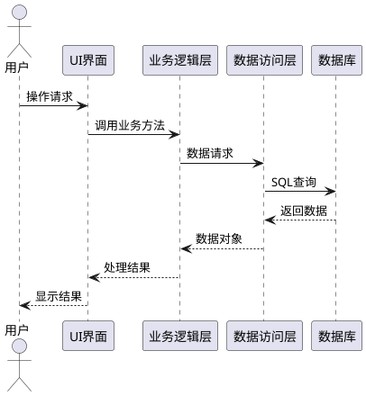
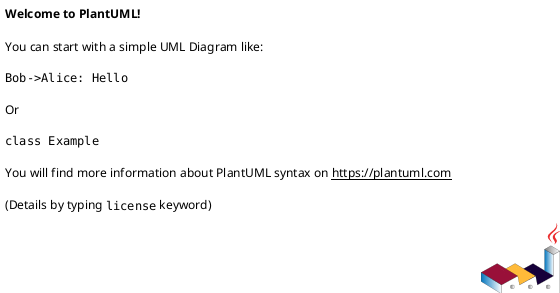
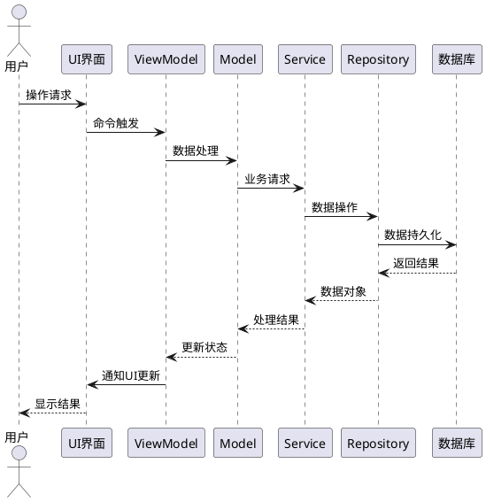
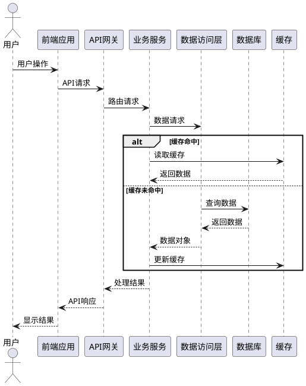
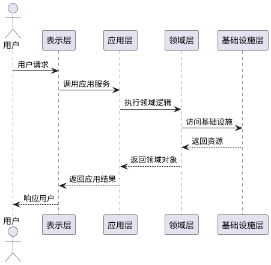
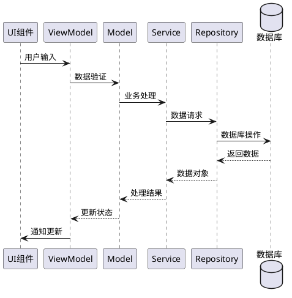

# 计科22《移动应用开发》课程考核大作业

> **重要提示**：本考核大作业包含四份报告（项目、小组、个人、答辩），必须全部提交才能获得有效成绩。四份报告缺一不可，缺少任何一份报告，大作业成绩为0分（占课程总成绩50%）！
> 
> **填写要求**：请按照以下顺序完成报告：
> 1. 首先完成答辩并通过答辩
> 2. 然后提交个人
> 3. 接着提交小组
> 4. 最后提交项目
> 
> **格式要求**：A4双面打印，总页数控制在30页以内

## 基本信息

> **填写说明**：请填写真实信息，项目名称应与实际开发项目一致，项目类型可选（如：教育类、社交类、工具类等）。

| 项目 | 内容 |
|------|------|
| **学号** |  |
| **姓名** |  |
| **班级** |  |
| **项目名称** |  |
| **小组成员** |  |
| **指导教师** |  |
| **完成时间** |  |

---

## 目录

1. [项目](#项目)
2. [小组](#小组)
3. [个人](#个人)
4. [答辩](#答辩)

---

## 项目

> **填写说明**：本报告占大作业成绩的25%（课程总成绩12.5%）。请详细描述项目的技术实现，包括需求分析、技术栈选择、架构设计、功能实现和测试优化等内容。每部分内容应具体、详细，避免空洞描述。

### 项目任务与需求

> **填写说明**：请详细描述项目的背景、目标和需求。功能需求应列出主要功能点，非功能需求应包括性能、安全、可用性等方面要求。

#### 1.1 项目背景与意义

#### 1.2 项目目标

#### 1.3 功能需求

#### 1.4 非功能需求

### 技术栈详解

> **填写说明**：请详细列出项目使用的技术栈，包括具体技术、版本和用途说明。技术栈应覆盖前端、后端和开发工具，确保技术选择的合理性和完整性。

#### 2.1 技术栈对比分析

| 序号 | 技术栈 | 负责成员 | 开发语言 | 主要框架/库 | 选择理由 |
|------|--------|----------|----------|-------------|----------|
| 1 | Android原生（必选） | | Java/Kotlin | Jetpack | |
| 2 | iOS原生 | | Swift | SwiftUI | |
| 3 | Flutter（必选） | | Dart | BLoC | |
| 4 | React Native（必选） | | JavaScript/TypeScript | Redux | |
| 5 | H5混合 | | HTML5/CSS3/JavaScript | | |
| 6 | Uniapp | | Vue.js | | |
| 7 | 微信小程序（必选） | | JavaScript | | |
| 8 | 鸿蒙ArkTS（必选） | | ArkTS | ArkUI | |
| 9 | MAUI | | C# | | |
| 10 | 后端服务 | | （填写） | | |
| 11 | SQLite数据库（必选） | | SQLite | | 存储用户数据、需求数据、评价数据等 |
| 12 | Firebase云服务（必选） | | Firebase | | 提供用户认证、数据库存储、消息通知等 |

#### 2.2 技术栈详细说明

> **填写说明**：请根据项目实际使用的技术栈，选择相应的部分进行详细填写。未使用的技术栈部分可以删除。

##### Android原生技术栈（如适用）

**开发环境**：
- **IDE**：Android Studio ___
- **SDK版本**：Android API ___
- **Gradle版本**：___

**核心技术**：
- **开发语言**：□ Java □ Kotlin
- **UI框架**：□ XML布局 □ Jetpack Compose
- **架构模式**：□ MVVM □ MVP □ MVC
- **依赖注入**：□ Hilt □ Dagger □ Koin □ 不使用
- **网络库**：□ Retrofit □ OkHttp □ Volley
- **图片加载**：□ Glide □ Picasso □ Coil
- **本地存储**：□ SharedPreferences □ Room □ SQLite
- **异步处理**：□ Coroutines □ RxJava □ AsyncTask

**特色功能实现**：
_______________________________________________________________

##### iOS原生技术栈（如适用）

**开发环境**：
- **IDE**：Xcode ___
- **iOS版本**：iOS ___
- **Swift版本**：___

**核心技术**：
- **开发语言**：□ Swift □ Objective-C
- **UI框架**：□ UIKit □ SwiftUI
- **架构模式**：□ MVVM □ MVC □ VIPER
- **网络库**：□ URLSession □ Alamofire
- **图片加载**：□ SDWebImage □ Kingfisher
- **本地存储**：□ UserDefaults □ CoreData □ Realm
- **响应式编程**：□ Combine □ RxSwift
- **依赖管理**：□ CocoaPods □ SPM □ Carthage

**特色功能实现**：
_______________________________________________________________

##### Flutter技术栈（如适用）

**开发环境**：
- **Flutter版本**：___
- **Dart版本**：___
- **IDE**：□ Android Studio □ VS Code

**核心技术**：
- **UI框架**：□ Material Design □ Cupertino □ 自定义
- **状态管理**：□ Provider □ Bloc □ GetX □ Riverpod
- **网络库**：□ http □ dio
- **本地存储**：□ shared_preferences □ sqflite □ Hive
- **路由管理**：□ Navigator □ GetX □ auto_route
- **国际化**：□ intl □ easy_localization

**常用插件**：
1. _______________
2. _______________
3. _______________

**特色功能实现**：
_______________________________________________________________

##### React Native技术栈（如适用）

**开发环境**：
- **React Native版本**：___
- **Node.js版本**：___
- **IDE**：□ VS Code □ WebStorm

**核心技术**：
- **开发语言**：□ JavaScript □ TypeScript
- **状态管理**：□ Redux □ MobX □ Context API □ Zustand
- **导航**：□ React Navigation □ React Native Navigation
- **网络库**：□ fetch □ axios
- **UI库**：□ React Native Elements □ NativeBase □ React Native Paper
- **本地存储**：□ AsyncStorage □ SQLite □ Realm

**常用第三方库**：
1. _______________
2. _______________
3. _______________

**特色功能实现**：
_______________________________________________________________

##### H5混合技术栈（如适用）

**开发环境**：
- **IDE**：VS Code / WebStorm / HBuilder
- **Node版本**：___
- **构建工具**：□ Webpack □ Vite □ Rollup

**核心技术**：
- **开发语言**：HTML5/CSS3/JavaScript/TypeScript
- **UI框架**：□ Vue.js □ React □ jQuery □ 原生
- **混合方案**：□ Cordova □ Capacitor □ 5+Runtime
- **WebView容器**：□ Android WebView □ WKWebView □ 其他
- **本地交互**：□ JSBridge □ Cordova插件 □ Capacitor插件

**H5特性**：
- □ 离线缓存（LocalStorage/IndexedDB）
- □ 原生能力调用（相机、定位等）
- □ 推送通知
- □ 文件上传下载

**特色功能实现**：
_______________________________________________________________

##### Uniapp技术栈（如适用）

**开发环境**：
- **HBuilderX版本**：___
- **Vue版本**：___

**核心技术**：
- **UI框架**：□ uni-ui □ uView □ 自定义
- **状态管理**：□ Vuex □ Pinia
- **条件编译**：支持平台_______________
- **云开发**：□ 使用 □ 不使用

**多端支持**：
- □ H5
- □ 微信小程序
- □ 支付宝小程序
- □ App（Android/iOS）

**特色功能实现**：
_______________________________________________________________

##### 微信小程序技术栈（如适用）

**开发环境**：
- **微信开发者工具版本**：___
- **基础库版本**：___

**核心技术**：
- **UI框架**：□ WeUI □ Vant Weapp □ 自定义
- **云开发**：□ 使用 □ 不使用
- **云函数**：_____ 个
- **云数据库**：□ 使用 □ 不使用
- **云存储**：□ 使用 □ 不使用

**小程序特性**：
- □ 分包加载
- □ 独立分包
- □ 订阅消息
- □ 分享功能
- □ 支付功能

**特色功能实现**：
_______________________________________________________________

##### 鸿蒙技术栈（必选）

**开发环境**：
- **DevEco Studio版本**：___
- **API Level**：___
- **SDK版本**：___

**核心技术**：
- **开发语言**：ArkTS
- **UI框架**：ArkUI（声明式）
- **状态管理**：装饰器（@State/@Prop/@Link/@Provide/@Consume等）
- **网络库**：@ohos.net.http
- **本地存储**：□ 首选项 □ 关系型数据库
- **分布式能力**：@ohos.distributeddata
- **传感器集成**：@ohos.sensor

**鸿蒙特性**：
- □ 分布式数据管理
- □ 跨设备协同
- □ 多设备适配（手机/平板/手表）
- □ 服务卡片
- □ 分布式任务调度
- □ 跨设备数据同步

**特色功能实现**：
_______________________________________________________________

##### MAUI技术栈（如适用）

**开发环境**：
- **IDE**：Visual Studio 2022 / Visual Studio for Mac
- **.NET版本**：.NET ___ (建议.NET 7+)
- **工作负载**：.NET Multi-platform App UI development

**核心技术**：
- **开发语言**：C#
- **UI框架**：.NET MAUI (XAML)
- **架构模式**：□ MVVM □ MVU
- **依赖注入**：Microsoft.Extensions.DependencyInjection
- **数据存储**：□ SQLite □ Preferences □ SecureStorage
- **网络请求**：HttpClient
- **状态管理**：□ CommunityToolkit.Mvvm □ 自定义
- **图表库**：□ Microcharts □ LiveCharts2 □ 自定义

**跨平台支持**：
- □ Android
- □ iOS
- □ Windows
- □ macOS

**特色功能实现**：
_______________________________________________________________

##### 后端服务技术栈（如适用）

**开发环境**：
- **IDE**：Visual Studio 2022 / VS Code / JetBrains Rider
- **.NET版本**：.NET ___ (建议.NET 7+)

**核心技术**：
- **开发语言**：C#
- **Web框架**：□ ASP.NET Core MVC □ ASP.NET Core Web API □ Minimal APIs
- **数据库**：□ SQL Server □ MySQL □ PostgreSQL □ SQLite □ MongoDB
- **ORM框架**：□ Entity Framework Core □ Dapper □ 自定义
- **身份验证**：□ JWT Bearer □ Cookie □ OAuth 2.0 □ OpenID Connect
- **API文档**：□ Swagger/OpenAPI □ 自定义
- **实时通信**：□ SignalR □ WebSocket □ 自定义
- **缓存**：□ Redis □ Memory Cache □ 分布式缓存
- **消息队列**：□ RabbitMQ □ Azure Service Bus □ 自定义

**部署方式**：
- □ 本地服务器
- □ 云服务器（阿里云/腾讯云/Azure等）
- □ 容器化（Docker）
- □ Serverless

**特色功能实现**：
_______________________________________________________________

##### SQLite数据库技术栈（必选）

**开发环境**：
- **SQLite版本**：___
- **IDE**：□ DB Browser for SQLite □ SQLite Expert □ 其他

**核心技术**：
- **数据库类型**：关系型数据库
- **数据表设计**：用户表、需求表、评价表等
- **数据类型**：INTEGER、TEXT、REAL、BLOB
- **索引优化**：主键索引、外键索引、复合索引
- **事务管理**：ACID特性、事务隔离级别
- **数据备份**：定期备份、增量备份

**数据库表结构**：

**用户表（users）**：
```sql
CREATE TABLE users (
    id INTEGER PRIMARY KEY AUTOINCREMENT,
    username TEXT NOT NULL UNIQUE,
    password TEXT NOT NULL,
    email TEXT UNIQUE,
    phone TEXT UNIQUE,
    created_at TIMESTAMP DEFAULT CURRENT_TIMESTAMP,
    updated_at TIMESTAMP DEFAULT CURRENT_TIMESTAMP
);
```

**需求表（requirements）**：
```sql
CREATE TABLE requirements (
    id INTEGER PRIMARY KEY AUTOINCREMENT,
    user_id INTEGER NOT NULL,
    title TEXT NOT NULL,
    description TEXT,
    status TEXT DEFAULT 'pending',
    created_at TIMESTAMP DEFAULT CURRENT_TIMESTAMP,
    updated_at TIMESTAMP DEFAULT CURRENT_TIMESTAMP,
    FOREIGN KEY (user_id) REFERENCES users(id)
);
```

**评价表（evaluations）**：
```sql
CREATE TABLE evaluations (
    id INTEGER PRIMARY KEY AUTOINCREMENT,
    user_id INTEGER NOT NULL,
    requirement_id INTEGER NOT NULL,
    rating INTEGER NOT NULL,
    comment TEXT,
    created_at TIMESTAMP DEFAULT CURRENT_TIMESTAMP,
    FOREIGN KEY (user_id) REFERENCES users(id),
    FOREIGN KEY (requirement_id) REFERENCES requirements(id)
);
```

**特色功能实现**：
_______________________________________________________________

##### Firebase云服务技术栈（必选）

**开发环境**：
- **Firebase版本**：___
- **Firebase项目ID**：___

**核心技术**：
- **用户认证**：Firebase Authentication
  - □ 邮箱/密码登录
  - □ 手机号登录
  - □ 第三方登录（Google、微信、QQ等）
  - □ 匿名登录
- **数据库存储**：Cloud Firestore
  - □ 实时数据库
  - □ 云Firestore
  - □ 数据结构设计
  - □ 数据同步机制
- **消息通知**：Cloud Messaging
  - □ 推送通知
  - □ 主题订阅
  - □ 消息处理
- **文件存储**：Cloud Storage
  - □ 图片上传
  - □ 文件下载
  - □ 存储桶管理

**Firebase配置**：

**用户认证配置**：
```javascript
// Firebase Authentication 配置
const firebaseConfig = {
  apiKey: "YOUR_API_KEY",
  authDomain: "YOUR_PROJECT_ID.firebaseapp.com",
  projectId: "YOUR_PROJECT_ID",
  storageBucket: "YOUR_PROJECT_ID.appspot.com",
  messagingSenderId: "YOUR_SENDER_ID",
  appId: "YOUR_APP_ID"
};

// 初始化 Firebase
firebase.initializeApp(firebaseConfig);

// 用户认证
const auth = firebase.auth();
auth.signInWithEmailAndPassword(email, password)
  .then((userCredential) => {
    // 登录成功
  })
  .catch((error) => {
    // 登录失败
  });
```

**数据库存储配置**：
```javascript
// Cloud Firestore 配置
const db = firebase.firestore();

// 存储用户数据
db.collection('users').doc(userId).set({
  username: username,
  email: email,
  createdAt: firebase.firestore.FieldValue.serverTimestamp()
});

// 查询用户数据
db.collection('users').doc(userId).get()
  .then((doc) => {
    if (doc.exists) {
      console.log("Document data:", doc.data());
    } else {
      console.log("No such document!");
    }
  });
```

**消息通知配置**：
```javascript
// Cloud Messaging 配置
const messaging = firebase.messaging();

// 请求通知权限
messaging.requestPermission()
  .then(() => {
    console.log('Notification permission granted.');
    return messaging.getToken();
  })
  .then((token) => {
    console.log('FCM Token:', token);
  })
  .catch((error) => {
    console.log('Unable to get permission to notify.', error);
  });
```

**特色功能实现**：
_______________________________________________________________

### 系统架构设计

> **填写说明**：请详细描述系统的整体架构、模块划分、数据流和关键设计模式。架构图应清晰展示系统各组件之间的关系，数据流图应展示主要业务流程。

#### 3.1 整体架构

#### 3.2 前端架构

#### 3.3 后端架构

#### 3.4 数据库设计

### 核心功能实现

> **填写说明**：请详细描述各功能模块的具体实现，包括核心业务逻辑处理和用户界面设计。每个功能模块应包含实现思路、**顺序图**和界面截图。顺序图应清晰展示关键流程中各组件之间的交互关系。

#### 4.1 功能模块一

**功能描述**：
_______________________________________________________________

**实现思路**：
_______________________________________________________________

**核心流程顺序图**：


**界面截图**：
_______________________________________________________________

#### 4.2 功能模块二

**功能描述**：
_______________________________________________________________

**实现思路**：
_______________________________________________________________

**核心流程顺序图**：


**界面截图**：
_______________________________________________________________

#### 4.3 功能模块三

**功能描述**：
_______________________________________________________________

**实现思路**：
_______________________________________________________________

**核心流程顺序图**：


**界面截图**：
_______________________________________________________________

#### 4.4 功能模块四

**功能描述**：
_______________________________________________________________

**实现思路**：
_______________________________________________________________

**核心流程顺序图**：


**界面截图**：
_______________________________________________________________

### 系统测试与优化

> **填写说明**：请详细描述项目的测试策略、测试用例和性能优化措施。测试应包括单元测试、集成测试和用户测试，优化应针对性能、用户体验和资源占用等方面。

#### 5.1 测试策略

#### 5.2 测试结果

#### 5.3 性能优化

#### 5.4 安全措施

### 项目成果展示

#### 6.1 系统截图

#### 6.2 核心功能演示

#### 6.3 创新点总结

---

## 小组

> **填写说明**：本报告占大作业成绩的25%（课程总成绩12.5%）。请详细描述小组的组织结构、分工协作、技术实现和团队管理等内容。重点突出团队合作、技术整合和项目管理能力。

### 小组结构与分工

> **填写说明**：请详细描述小组的组织结构、成员角色、技术能力分配和具体任务分工。应明确每个成员的职责和贡献，确保分工合理、协作高效。

#### 1.1 小组组织结构

#### 1.2 成员角色与职责

#### 1.3 技术能力分配

#### 1.4 任务分工说明

### 技术栈选择与理由

#### 2.1 技术选型过程

#### 2.2 技术优势分析

#### 2.3 技术挑战与解决方案

### 技术整合与实现

> **填写说明**：请详细描述小组如何整合不同技术栈、解决技术冲突和实现技术协同。重点说明技术整合的挑战、解决方案和最终效果。

### 开发阶段工作

> **填写说明**：请详细描述项目的开发流程、各阶段工作内容和成果。应包括需求分析、设计、开发、测试和部署等阶段，说明各阶段的输入、输出和关键活动。

#### 3.1 项目启动阶段

#### 3.2 核心开发阶段

#### 3.3 系统整合阶段

#### 3.4 测试交付阶段

### 团队协作分析

> **填写说明**：请详细分析团队的协作模式、沟通机制和冲突解决方法。应包括团队协作的优势、存在的问题和改进措施，以及团队协作对项目成功的影响。

#### 4.1 团队组织结构

#### 4.2 沟通机制

#### 4.3 任务分配

#### 4.4 协作工具使用

### 团队贡献分析

> **填写说明**：请详细分析每个团队成员的贡献，包括工作量、技术贡献和管理贡献等。应客观评价每个成员的贡献，并提供具体事例和数据支持。

#### 5.1 成员贡献评估

#### 5.2 工作量分配

#### 5.3 关键贡献点

### 团队创新与亮点

> **填写说明**：请详细描述团队在项目开发过程中的创新点和亮点，包括技术创新、设计创新和管理创新等。应突出团队的创新能力和独特贡献。

#### 6.1 技术创新

#### 6.2 功能创新

#### 6.3 过程创新

### 团队成长与收获

> **填写说明**：请详细描述团队在项目开发过程中的成长和收获，包括技术能力提升、团队协作能力提升和项目管理能力提升等。应具体说明团队如何克服困难、解决问题并取得进步。

#### 7.1 技术能力提升

#### 7.2 团队协作能力

#### 7.3 项目管理能力

### 团队发展建议

> **填写说明**：请详细分析团队在项目开发过程中存在的问题和不足，并提出具体的改进建议。建议应针对团队协作、技术能力、项目管理等方面，具有可操作性和实用性。

#### 8.1 项目改进建议

#### 8.2 团队协作优化

#### 8.3 技术学习建议

---

## 个人

> **填写说明**：本报告占大作业成绩的25%（课程总成绩12.5%）。请详细描述个人在项目中的技术贡献、工作内容、创新点和成长收获。重点突出个人技术能力、解决问题能力和学习成长能力。

### 个人负责技术栈

> **填写说明**：请详细列出个人负责的技术栈，包括具体技术、版本和掌握程度。应客观评价个人对各项技术的掌握情况，并提供具体事例证明。

#### 1.1 前端技术

#### 1.2 后端技术

#### 1.3 开发工具

### 必须提交的技术图表

> **填写说明**：请使用图表展示个人负责的技术架构、数据流和关键算法。图表应清晰、准确，能够直观展示技术实现的关键点。

#### 2.1 技术架构图
#### 2.2 数据流图
#### 2.3 核心算法流程图
#### 2.4 系统交互图

### 开发阶段工作内容

> **填写说明**：请详细描述个人在项目中的具体工作内容，包括需求分析、设计、开发、测试和文档编写等。应提供具体的工作量统计和**关键流程顺序图**。顺序图应清晰展示您负责的关键功能中各组件之间的交互关系。

#### 3.1 项目启动阶段

**工作内容**：
_______________________________________________________________

**工作量统计**：
- 需求分析：_____ 小时
- 技术调研：_____ 小时
- 方案设计：_____ 小时
- 文档编写：_____ 小时
- **合计**：_____ 小时

**关键流程顺序图**（如适用）：


#### 3.2 核心开发阶段

**工作内容**：
_______________________________________________________________

**工作量统计**：
- 模块设计：_____ 小时
- 代码实现：_____ 小时
- 单元测试：_____ 小时
- 代码审查：_____ 小时
- **合计**：_____ 小时

**关键流程顺序图**：


#### 3.3 系统整合阶段

**工作内容**：
_______________________________________________________________

**工作量统计**：
- 接口对接：_____ 小时
- 数据同步：_____ 小时
- 功能联调：_____ 小时
- 性能优化：_____ 小时
- **合计**：_____ 小时

**关键流程顺序图**：


#### 3.4 测试交付阶段

**工作内容**：
_______________________________________________________________

**工作量统计**：
- 集成测试：_____ 小时
- 问题修复：_____ 小时
- 文档完善：_____ 小时
- 部署准备：_____ 小时
- **合计**：_____ 小时

**关键流程顺序图**（如适用）：


### 个人创新与亮点

> **填写说明**：请详细描述个人在项目中的创新点和亮点，包括技术创新、设计创新和解决方案创新等。应突出个人的创新能力和独特贡献。

#### 4.1 技术创新

#### 4.2 功能创新

#### 4.3 过程优化

### 个人成长与收获

> **填写说明**：请详细描述个人在项目开发过程中的成长和收获，包括技术能力提升、解决问题能力提升和团队协作能力提升等。应具体说明个人如何克服困难、解决问题并取得进步。

#### 5.1 技术能力提升

#### 5.2 问题解决能力

#### 5.3 团队协作能力

### 个人发展计划

> **填写说明**：请根据项目开发经验和个人成长情况，制定合理的个人发展计划。计划应具体、可行，包括技能提升、技术学习和项目实践等方面。

#### 6.1 移动开发技能提升计划

#### 6.2 跨平台技术学习方向

#### 6.3 后续项目实践建议

---

## 答辩

> **填写说明**：本报告占大作业成绩的25%（课程总成绩12.5%）。请详细准备答辩内容，包括项目概述、技术实现、创新亮点和答辩问题准备。答辩应突出项目价值、技术难度和个人贡献。

### 答辩要求

> **填写说明**：请仔细阅读并理解答辩要求，包括答辩时间、内容要求和评分标准。答辩应准备充分，内容精炼，重点突出。

### 答辩内容

> **填写说明**：请详细准备答辩内容，包括项目概述、技术实现、创新亮点和个人贡献。内容应简明扼要，重点突出，便于答辩时清晰表达。

#### 1.1 必答题

1. 请介绍项目背景、目标和主要功能
2. 请详细说明您负责的技术栈和实现方法
3. 请展示项目的核心功能和亮点

#### 1.2 随机题

#### 1.3 演示材料要求

#### 1.4 答辩流程

### 核心技术实现

#### 2.1 技术架构

**架构概述**：
_______________________________________________________________

**架构顺序图**：


#### 2.2 关键技术点

**技术点1：_______________**
**技术描述**：
_______________________________________________________________

**实现顺序图**：


**技术点2：_______________**
**技术描述**：
_______________________________________________________________

**实现顺序图**：


#### 2.3 技术难点与解决方案

**难点1：_______________**
**问题描述**：
_______________________________________________________________

**解决方案**：
_______________________________________________________________

**解决流程顺序图**：


**难点2：_______________**
**问题描述**：
_______________________________________________________________

**解决方案**：
_______________________________________________________________

**解决流程顺序图**：


### 架构设计思路

#### 3.1 整体架构设计

**设计理念**：
_______________________________________________________________

**架构交互顺序图**：


#### 3.2 模块划分

**模块1：_______________**
**职责描述**：
_______________________________________________________________

**模块交互顺序图**：


**模块2：_______________**
**职责描述**：
_______________________________________________________________

**模块交互顺序图**：


#### 3.3 数据流设计

**数据流概述**：
_______________________________________________________________

**数据流顺序图**：


### 创新点分析

#### 4.1 技术创新

**创新点1：_______________**
**创新描述**：
_______________________________________________________________

**创新实现顺序图**：


**创新点2：_______________**
**创新描述**：
_______________________________________________________________

**创新实现顺序图**：


#### 4.2 功能创新

**创新功能1：_______________**
**功能描述**：
_______________________________________________________________

**功能实现顺序图**：


**创新功能2：_______________**
**功能描述**：
_______________________________________________________________

**功能实现顺序图**：
```plantuml
@startuml
' 请在此处填写顺序图代码，展示功能创新点2的实现流程
@enduml
```

#### 4.3 应用创新

**创新应用1：_______________**
**应用描述**：
_______________________________________________________________

**应用实现顺序图**：
```plantuml
@startuml
' 请在此处填写顺序图代码，展示应用创新点1的实现流程
@enduml
```

**创新应用2：_______________**
**应用描述**：
_______________________________________________________________

**应用实现顺序图**：
```plantuml
@startuml
' 请在此处填写顺序图代码，展示应用创新点2的实现流程
@enduml
```

### 功能演示

#### 5.1 演示流程

**演示概述**：
_______________________________________________________________

**演示流程顺序图**：
```plantuml
@startuml
' 请在此处填写顺序图代码，展示功能演示的流程
' 示例：
actor 演示者 as presenter
actor 评审者 as reviewer
participant "应用系统" as system

presenter -> system: 启动应用
presenter -> system: 执行功能1
system --> presenter: 显示结果1
presenter -> reviewer: 解释功能1
reviewer -> presenter: 提问1
presenter -> reviewer: 回答1

presenter -> system: 执行功能2
system --> presenter: 显示结果2
presenter -> reviewer: 解释功能2
reviewer -> presenter: 提问2
presenter -> reviewer: 回答2

presenter -> system: 执行功能3
system --> presenter: 显示结果3
presenter -> reviewer: 解释功能3
reviewer -> presenter: 提问3
presenter -> reviewer: 回答3
@enduml
```

#### 5.2 核心功能展示

**核心功能1：_______________**
**功能描述**：
_______________________________________________________________

**功能实现顺序图**：
```plantuml
@startuml
' 请在此处填写顺序图代码，展示核心功能1的实现流程
@enduml
```

**核心功能2：_______________**
**功能描述**：
_______________________________________________________________

**功能实现顺序图**：
```plantuml
@startuml
' 请在此处填写顺序图代码，展示核心功能2的实现流程
@enduml
```

#### 5.3 亮点功能说明

**亮点功能1：_______________**
**功能描述**：
_______________________________________________________________

**功能实现顺序图**：
```plantuml
@startuml
' 请在此处填写顺序图代码，展示亮点功能1的实现流程
@enduml
```

**亮点功能2：_______________**
**功能描述**：
_______________________________________________________________

**功能实现顺序图**：
```plantuml
@startuml
' 请在此处填写顺序图代码，展示亮点功能2的实现流程
@enduml
```

### 随机题准备

#### 6.1 技术类问题

#### 6.2 设计类问题

#### 6.3 应用类问题

### 答辩问题准备

> **填写说明**：请提前准备可能被问到的答辩问题，并思考如何回答。问题应涵盖项目技术、创新点、个人贡献和团队协作等方面。

### 准备清单

> **填写说明**：请使用以下清单检查答辩准备情况，确保所有必要材料都已准备齐全。答辩前应逐项检查，确保万无一失。

#### 8.1 演示材料

#### 8.2 技术文档

#### 8.3 答辩PPT

### 注意事项

#### 9.1 时间控制

#### 9.2 重点突出

#### 9.3 问答准备

## 成绩记录

> **填写说明**：本部分由教师填写，记录四份报告的成绩和总成绩。学生无需填写此部分。

| 报告类型 | 成绩 | 权重 | 得分 |
|----------|------|------|------|
| 答辩 |  | 30% |  |
| 个人 |  | 20% |  |
| 小组 |  | 20% |  |
| 项目 |  | 30% |  |
| **总成绩** |  | 100% |  |

---

### 教师评语与签名

> **填写说明**：本部分由教师填写，包括对学生的评语、签名和评定日期。学生无需填写此部分。

**教师评语：**

**教师签名：** _______________

**评定日期：** ____年__月__日

---

## Gitee项目仓库

> **填写说明**：本项目要求使用 Gitee 进行版本控制和团队协作。请详细描述 Gitee 仓库的创建、使用和管理情况，包括仓库结构、分支策略、提交规范和协作流程等。

### Gitee仓库创建

> **填写说明**：请详细描述 Gitee 仓库的创建过程，包括仓库命名、初始化、权限设置等。

#### 1.1 仓库信息

| 项目 | 内容 |
|------|------|
| **仓库名称** | |
| **仓库地址** | |
| **仓库描述** | |
| **创建时间** | |
| **仓库类型** | □ 公开 □ 私有 |

#### 1.2 仓库结构

```
项目根目录/
├── android/              # Android 原生应用
├── ios/                  # iOS 原生应用
├── flutter/              # Flutter 应用
├── react_native/         # React Native 应用
├── uniapp/              # Uniapp 应用
├── wechat_miniprogram/   # 微信小程序
├── harmonyos/           # 鸿蒙应用
├── backend/             # 后端服务
├── docs/                # 项目文档
│   ├── 需求文档.md
│   ├── 架构设计.md
│   ├── API文档.md
│   └── 测试报告.md
├── diagrams/            # PlantUML 图表
│   ├── 架构图.puml
│   ├── 类图.puml
│   └── 顺序图.puml
└── README.md            # 项目说明
```

### 分支管理策略

> **填写说明**：请详细描述项目的分支管理策略，包括分支命名规范、合并策略和发布流程等。

#### 2.1 分支结构

| 分支名称 | 用途 | 说明 |
|----------|------|------|
| main | 主分支 | 生产环境代码 |
| dev | 开发分支 | 开发环境代码 |
| feature/* | 功能分支 | 开发新功能 |
| bugfix/* | 修复分支 | 修复 Bug |
| release/* | 发布分支 | 准备发布 |

#### 2.2 分支命名规范

- **功能分支**：feature/功能描述（如：feature/user-login）
- **修复分支**：bugfix/问题描述（如：bugfix/login-error）
- **发布分支**：release/版本号（如：release/v1.0.0）

### 提交规范

> **填写说明**：请详细描述项目的提交规范，包括提交信息格式、提交频率和代码审查流程等。

#### 3.1 提交信息格式

```
<type>(<scope>): <subject>

<body>

<footer>
```

**类型（type）**：
- feat：新功能
- fix：修复 Bug
- docs：文档更新
- style：代码格式调整
- refactor：重构
- test：测试相关
- chore：构建过程或辅助工具的变动

**示例**：
```
feat(user): 添加用户注册功能

- 实现用户注册接口
- 添加表单验证
- 集成 Firebase 认证

Closes #123
```

#### 3.2 提交统计

| 成员 | 提交次数 | 代码行数 | 功能数 | Bug 修复数 |
|------|----------|----------|--------|------------|
| | | | | |
| | | | | |
| | | | | |
| **合计** | | | | |

### 协作流程

> **填写说明**：请详细描述团队的协作流程，包括代码审查、冲突解决和发布流程等。

#### 4.1 代码审查流程

1. 开发人员创建功能分支
2. 完成开发后提交 Pull Request
3. 至少 2 人进行代码审查
4. 审查通过后合并到 dev 分支
5. 定期从 dev 分支合并到 main 分支

#### 4.2 冲突解决流程

1. 发现冲突后及时通知相关成员
2. 协商解决冲突方案
3. 本地测试解决后的代码
4. 提交并更新远程仓库

---

## 贡献评估

> **填写说明**：本部分用于评估团队成员的贡献，包括代码质量、功能完善、性能优化等方面。评估应客观、公正，并提供具体事例和数据支持。

### 代码质量评估

> **填写说明**：请详细评估代码质量，包括代码规范、代码注释、代码复用和代码测试等方面。

#### 1.1 代码规范

| 成员 | 命名规范 | 代码格式 | 注释完整度 | 评分（0-10） |
|------|----------|----------|------------|-------------|
| | | | | |
| | | | | |
| | | | | |

#### 1.2 代码复用

| 成员 | 复用模块数 | 复用率 | 评分（0-10） |
|------|------------|--------|-------------|
| | | | |
| | | | |
| | | | |

#### 1.3 代码测试

| 成员 | 测试用例数 | 测试覆盖率 | 测试通过率 | 评分（0-10） |
|------|------------|------------|------------|-------------|
| | | | | |
| | | | | |
| | | | | |

### 功能完善评估

> **填写说明**：请详细评估功能完善程度，包括功能完整性、功能稳定性和功能创新性等方面。

#### 2.1 功能完整性

| 成员 | 负责功能数 | 完成功能数 | 完成率 | 评分（0-10） |
|------|------------|------------|--------|-------------|
| | | | | |
| | | | | |
| | | | | |

#### 2.2 功能稳定性

| 成员 | Bug 数量 | 严重 Bug 数 | Bug 修复率 | 评分（0-10） |
|------|----------|------------|------------|-------------|
| | | | | |
| | | | | |
| | | | | |

#### 2.3 功能创新性

| 成员 | 创新功能数 | 创新点说明 | 评分（0-10） |
|------|------------|------------|-------------|
| | | | |
| | | | |
| | | | |

### 性能优化评估

> **填写说明**：请详细评估性能优化情况，包括启动速度、内存占用、网络性能和 UI 渲染等方面。

#### 3.1 启动速度

| 平台 | 优化前 | 优化后 | 提升率 | 评分（0-10） |
|------|--------|--------|--------|-------------|
| Android | | | | |
| iOS | | | | |
| Flutter | | | | |
| React Native | | | | |
| 鸿蒙 | | | | |
| 微信小程序 | | | | |

#### 3.2 内存占用

| 平台 | 优化前 | 优化后 | 降低率 | 评分（0-10） |
|------|--------|--------|--------|-------------|
| Android | | | | |
| iOS | | | | |
| Flutter | | | | |
| React Native | | | | |
| 鸿蒙 | | | | |
| 微信小程序 | | | | |

#### 3.3 网络性能

| 平台 | 优化前 | 优化后 | 提升率 | 评分（0-10） |
|------|--------|--------|--------|-------------|
| Android | | | | |
| iOS | | | | |
| Flutter | | | | |
| React Native | | | | |
| 鸿蒙 | | | | |
| 微信小程序 | | | | |

### 综合贡献评分

> **填写说明**：请根据以上评估结果，计算每个成员的综合贡献评分。

| 成员 | 代码质量（30%） | 功能完善（40%） | 性能优化（30%） | 综合评分 | 排名 |
|------|----------------|----------------|----------------|----------|------|
| | | | | | |
| | | | | | |
| | | | | | |

---

## AI 批阅环节

> **填写说明**：本项目引入 AI 批阅环节，学生提交项目代码后，AI 会自动批阅，提供反馈和建议。本部分说明 AI 批阅的流程、标准和要求。

### AI 批阅流程

> **填写说明**：请详细描述 AI 批阅的流程，包括代码提交、AI 分析、反馈生成和改进建议等。

#### 1.1 批阅流程图

```plantuml
@startuml
actor 学生 as student
participant "Gitee 仓库" as gitee
participant "AI 批阅系统" as ai
participant "反馈报告" as report

student -> gitee: 提交项目代码
gitee -> ai: 触发 AI 批阅
ai -> ai: 代码静态分析
ai -> ai: 代码质量评估
ai -> ai: 功能完整性检查
ai -> ai: 性能测试
ai -> report: 生成反馈报告
report -> student: 提供反馈和建议
student -> gitee: 根据反馈改进代码
gitee -> ai: 重新触发 AI 批阅
ai -> student: 确认最终结果
@enduml
```

#### 1.2 批阅时间节点

| 阶段 | 时间 | 批阅内容 | 反馈时间 |
|------|------|----------|----------|
| 中期检查 | 第 7 天 | 核心功能代码 | 24 小时内 |
| 最终提交 | 第 14 天 | 完整项目代码 | 48 小时内 |

### AI 批阅标准

> **填写说明**：请详细描述 AI 批阅的标准，包括代码质量、功能完整性、性能指标和文档完整性等方面。

#### 2.1 代码质量标准

| 评估项 | 权重 | 评分标准 |
|--------|------|----------|
| 代码规范 | 30% | 符合编码规范，命名清晰，格式统一 |
| 代码注释 | 20% | 注释完整，逻辑清晰，易于理解 |
| 代码复用 | 20% | 合理复用代码，避免重复 |
| 错误处理 | 30% | 异常处理完善，边界条件考虑周全 |

#### 2.2 功能完整性标准

| 评估项 | 权重 | 评分标准 |
|--------|------|----------|
| 核心功能 | 40% | 所有核心功能正常工作 |
| 边缘场景 | 20% | 边缘场景处理合理 |
| 用户交互 | 20% | 用户交互流畅，体验良好 |
| 错误提示 | 20% | 错误提示清晰，用户友好 |

#### 2.3 性能指标标准

| 评估项 | 权重 | 评分标准 |
|--------|------|----------|
| 启动速度 | 30% | 冷启动 < 3 秒，热启动 < 1 秒 |
| 内存占用 | 25% | 内存占用 < 200 MB |
| 网络性能 | 25% | API 响应时间 < 500 ms |
| UI 渲染 | 20% | FPS ≥ 60，无卡顿 |

#### 2.4 文档完整性标准

| 评估项 | 权重 | 评分标准 |
|--------|------|----------|
| 技术文档 | 30% | 文档完整，结构清晰 |
| 代码注释 | 30% | 注释充分，易于理解 |
| 图表规范 | 20% | PlantUML 图表规范，清晰易懂 |
| 提交记录 | 20% | 提交规范，记录完整 |

### AI 反馈与改进

> **填写说明**：请详细描述 AI 反馈的内容和改进建议，包括代码改进建议、功能优化建议和性能优化建议等。

#### 3.1 代码改进建议

**改进点1：_______________**
**问题描述**：
_______________________________________________________________

**改进建议**：
_______________________________________________________________

**改进效果**：
_______________________________________________________________

#### 3.2 功能优化建议

**优化点1：_______________**
**问题描述**：
_______________________________________________________________

**优化建议**：
_______________________________________________________________

**优化效果**：
_______________________________________________________________

#### 3.3 性能优化建议

**优化点1：_______________**
**问题描述**：
_______________________________________________________________

**优化建议**：
_______________________________________________________________

**优化效果**：
_______________________________________________________________

---

## 项目管理环节

> **填写说明**：本项目强调项目管理，学生需要在项目中进行有效的沟通和合作，确保项目按计划进行。本部分详细描述项目管理的各个环节，包括计划制定、进度跟踪、风险管理和沟通协作等。

### 项目计划制定

> **填写说明**：请详细描述项目计划的制定过程，包括目标设定、任务分解、时间安排和资源分配等。

#### 1.1 项目目标

| 目标类型 | 目标描述 | 完成标准 | 优先级 |
|----------|----------|----------|--------|
| 功能目标 | | | 高 |
| 性能目标 | | | 高 |
| 质量目标 | | | 中 |
| 学习目标 | | | 中 |

#### 1.2 任务分解

| 任务编号 | 任务名称 | 负责人 | 开始时间 | 结束时间 | 状态 |
|----------|----------|--------|----------|----------|------|
| T001 | | | | | |
| T002 | | | | | |
| T003 | | | | | |
| T004 | | | | | |

#### 1.3 时间安排

| 阶段 | 时间 | 主要任务 | 交付物 |
|------|------|----------|--------|
| 项目启动 | 第 1-3 天 | 需求分析、架构设计、环境搭建 | 需求文档、架构图 |
| 核心开发 | 第 4-7 天 | 功能开发、单元测试 | 功能模块、测试报告 |
| 系统整合 | 第 8-12 天 | 接口对接、数据同步、性能优化 | 整合报告、性能数据 |
| 测试交付 | 第 13-15 天 | 集成测试、Bug 修复、文档完善 | 测试报告、项目文档 |

### 进度跟踪

> **填写说明**：请详细描述项目进度的跟踪过程，包括进度报告、里程碑检查和偏差分析等。

#### 2.1 进度报告

| 日期 | 完成任务 | 进度 | 存在问题 | 解决方案 |
|------|----------|------|----------|----------|
| | | | | |
| | | | | |
| | | | | |

#### 2.2 里程碑检查

| 里程碑 | 计划时间 | 实际时间 | 完成情况 | 偏差分析 |
|--------|----------|----------|----------|----------|
| 需求评审 | | | | |
| 中期检查 | | | | |
| 最终提交 | | | | |
| 答辩演示 | | | | |

#### 2.3 偏差分析

| 偏差类型 | 偏差原因 | 影响程度 | 纠正措施 |
|----------|----------|----------|----------|
| 进度偏差 | | | |
| 质量偏差 | | | |
| 资源偏差 | | | |

### 风险管理

> **填写说明**：请详细描述项目风险管理的过程，包括风险识别、风险评估和风险应对等。

#### 3.1 风险识别

| 风险编号 | 风险描述 | 风险类型 | 发生概率 | 影响程度 |
|----------|----------|----------|----------|----------|
| R001 | | | | |
| R002 | | | | |
| R003 | | | | |

#### 3.2 风险应对

| 风险编号 | 应对策略 | 应对措施 | 责任人 | 状态 |
|----------|----------|----------|--------|------|
| R001 | | | | |
| R002 | | | | |
| R003 | | | | |

### 沟通协作

> **填写说明**：请详细描述团队的沟通协作情况，包括沟通机制、会议记录和问题解决等。

#### 4.1 沟通机制

| 沟通方式 | 频率 | 参与人员 | 记录方式 |
|----------|------|----------|----------|
| 每日站会 | 每天 | 全体成员 | 会议记录 |
| 周例会 | 每周 | 全体成员 | 会议纪要 |
| 技术评审 | 按需 | 相关成员 | 评审报告 |
| 代码审查 | 按需 | 相关成员 | 审查记录 |

#### 4.2 会议记录

| 日期 | 会议类型 | 参与人员 | 讨论内容 | 决策事项 | 待办事项 |
|------|----------|----------|----------|----------|----------|
| | | | | | |
| | | | | | |
| | | | | | |

#### 4.3 问题解决

| 问题编号 | 问题描述 | 发现时间 | 责任人 | 解决方案 | 解决时间 | 状态 |
|----------|----------|----------|--------|----------|----------|------|
| I001 | | | | | | |
| I002 | | | | | | |
| I003 | | | | | | |

### 项目总结

> **填写说明**：请详细总结项目的完成情况，包括成果总结、经验教训和改进建议等。

#### 5.1 成果总结

| 成果类型 | 成果描述 | 完成情况 | 评价 |
|----------|----------|----------|------|
| 功能成果 | | | |
| 技术成果 | | | |
| 文档成果 | | | |
| 团队成果 | | | |

#### 5.2 经验教训

**成功经验**：
1. _______________________________________________________________
2. _______________________________________________________________
3. _______________________________________________________________

**失败教训**：
1. _______________________________________________________________
2. _______________________________________________________________
3. _______________________________________________________________

#### 5.3 改进建议

**对个人的改进建议**：
1. _______________________________________________________________
2. _______________________________________________________________
3. _______________________________________________________________

**对团队的改进建议**：
1. _______________________________________________________________
2. _______________________________________________________________
3. _______________________________________________________________

**对项目的改进建议**：
1. _______________________________________________________________
2. _______________________________________________________________
3. _______________________________________________________________