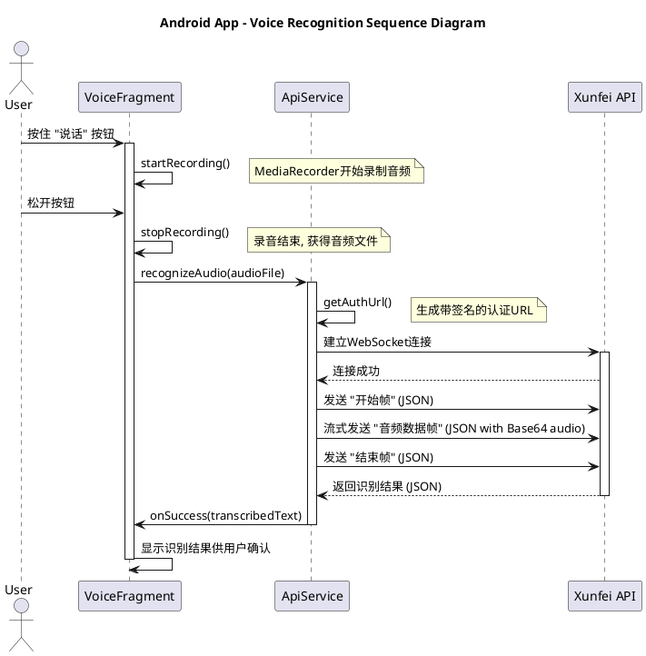

# Android版AI问答系统开发文档

## 1. 引言

本文档为`HelloWorld` AI问答系统的**Android版**提供全面的开发和维护指南。该应用是一个功能完整的原生Android App，旨在演示如何整合**三大AI平台**（讯飞、智谱AI、DeepSeek），并为用户提供一套灵活、健壮的AI功能，包括：
- **可切换模型的文本问答** (智谱AI / DeepSeek)
- **真实的实时语音识别** (讯飞)
- **双服务器保障的UML图生成** (PlantUML / Kroki)

---

## 2. 项目架构与技术栈

- **语言**: Java
- **核心框架**: Android SDK (Min SDK 24)
- **架构模式**: 基于Fragment和服务（Service）的事件驱动模型。
  - **UI层 (`Fragment`)**: `ChatFragment`, `VoiceFragment`, `PumlFragment`分别管理三大功能模块。
  - **服务层 (`Service`)**: `ApiService`集中处理所有外部网络请求；`StorageService`负责本地数据持久化（如模型选择）。
- **核心依赖**:
  - **UI组件**: `AppCompat`, `Material Components`, `RecyclerView`, `ConstraintLayout`
  - **HTTP客户端**: **OkHttp 4.12.0** (负责所有网络通信，包括WebSocket)
  - **JSON处理**: `org.json` (内置库) 
---

## 3. 核心功能实现详解 (`ApiService.java`)

`ApiService`是应用的网络核心，它封装了与所有外部AI平台的通信逻辑。

### 3.1. AI问答 (智谱AI & DeepSeek)

- **实现方式**: 应用实现了在智谱AI (`glm-4`) 和 DeepSeek (`deepseek-chat`) 两个模型之间动态切换的功能。
- **切换逻辑**:
    1. 用户通过主界面右上角的菜单选择偏好的AI模型。
    2. 选项被保存在`SharedPreferences`中。
    3. `ChatFragment`和`VoiceFragment`在调用`ApiService.getAiCompletion()`时，会读取保存的选项，并将其作为参数传递。
    4. `ApiService`根据传入的模型参数，动态选择对应的API密钥、URL和模型ID来构建网络请求。

### 3.2. 语音识别 (讯飞)

- **实现方式**: **完整集成了讯飞语音听写的流式WebSocket API**，实现了真实的实时语音转文字功能。
- **核心流程**:
    1. **鉴权**: `getAuthUrl()`方法根据讯飞的规则，使用API Key和Secret生成一个包含HMAC-SHA256签名的一次性认证URL。
    2. **连接**: 使用OkHttp客户端与该URL建立WebSocket连接。
    3. **数据传输**:
        - 连接建立后，首先发送一个“开始帧”（JSON对象），包含音频格式（`amr`, `8000`采样率）等信息。
        - 接着，将录制的音频文件分块（每块1280字节），进行**Base64编码**，然后**封装在JSON对象中**，作为“音频数据帧”流式发送。
        - 发送完毕后，发送一个“结束帧”（JSON对象）。
    4. **结果解析**: 实时监听服务器返回的消息，解析JSON获取识别出的文字片段，并在识别结束后拼接成完整的一句话。

### 3.3. UML图生成 (PlantUML & Kroki)

- **实现方式**: 为确保高可用性，应用提供了两个在线服务器选项来生成UML图。
- **服务器选项**:
    1. **服务器1 (PlantUML)**: 调用PlantUML官方服务器 (`http://www.plantuml.com/plantuml/png`)。
    2. **服务器2 (Kroki)**: 调用为程序化使用而优化的Kroki服务器 (`https://kroki.io/plantuml/png`)。
- **调用逻辑**: `generateDiagram()`方法接收一个服务器类型参数。根据该参数，它会向对应的URL发起一个POST请求，请求体中包含PUML文本。

---

## 4. 开发过程中的挑战与解决方案 (踩坑总结)

本项目在开发过程中遇到了一系列典型的Android原生开发和API集成问题。记录这些“坑”及其解决方案，对后续维护和开发有重要价值。

1.  **【最关键】本地JAR在Android上不兼容**:
    - **问题**: 曾尝试在应用内直接调用`plantuml.jar`以实现离线生成。但应用在调用时立即因`java.lang.NoClassDefFoundError: java.awt.image.BufferedImage`而崩溃。
    - **原因**: 标准的`plantuml.jar`依赖Java桌面版图形库(`java.awt`)，而Android系统为了轻量化，**并未包含此库**。这是平台级的兼容性问题，无法通过简单引入JAR包解决。
    - **解决方案**: **果断放弃本地生成方案**，改为提供多个可靠的在线服务器作为替代，确保了功能的稳定性。

2.  **讯飞WebSocket API集成**:
    - **问题1**: 连接时出现`unknown protocol: wss`错误。
    - **原因**: OkHttp的默认配置在某些设备/网络环境下可能无法正确协商`wss`（安全WebSocket）协议。
    - **解决方案**: 在构建OkHttp客户端时，**强制指定协议为HTTP/1.1** (`.protocols(Collections.singletonList(Protocol.HTTP_1_1))`)，解决了连接问题。
    - **问题2**: 连接成功后，服务器返回`request data must be valid json string`错误。
    - **原因与解决方案**: 这是最隐蔽的错误。讯飞的流式API**要求音频数据本身也必须被封装在JSON对象里**，而不是直接发送原始二进制数据。正确的做法是将每一小段音频进行Base64编码，然后放入一个JSON对象 (`{"data": {"status": 1, "audio": "base64-encoded-audio"}}`)再发送。
    - **问题3**: 服务器返回音频参数错误。
    - **原因**: 发送的“开始帧”中，编码格式(`amr`)与采样率(`16000`)不匹配。AMR_NB的正确采样率是`8000`。修正参数后问题解决。

3.  **在线PUML服务器集成**:
    - **问题**: 连接PlantUML官方服务器返回`400 Bad Request`或无效图片数据。
    - **原因**: 1) URL末尾多了个斜杠 (`/png/`应为`/png`)。2) 服务器可能进行了User-Agent检查，拒绝了来自非浏览器的程序化请求。
    - **解决方案**: 修正URL，并在所有网络请求中**添加一个模拟浏览器的User-Agent头**，成功绕过限制。同时引入Kroki作为备用服务器，提高了健壮性。

4.  **Android模拟器音频问题**:
    - **问题**: 在模拟器上，语音识别总是返回“未能识别语音”。
    - **原因**: Android模拟器的麦克风实现并不可靠，经常无法正确录制到声音，导致发送给服务器的是静音音频。
    - **解决方案**: **在真实的物理设备上进行测试**。这是验证语音相关功能的唯一可靠方法。

5.  **网络请求超时**:
    - **问题**: 在网络状况不佳时，AI问答请求超时。
    - **解决方案**: 将OkHttp客户端的连接、读取和写入超时时间从默认的10秒**延长至60秒**，提高了应用在慢速网络下的可用性。

---

## 5. 如何运行项目

1.  **环境要求**:
    - Android Studio (最新稳定版)
    - Android SDK Platform 32 或更高版本
    - **SDK路径**: `D:\\development\\Android`
    - **模拟器路径**: `D:\\development\\Android\\emulator`
2.  **API密钥**:
    - 项目代码中已包含所有必要的API密钥，无需额外配置即可运行。
3.  **构建与运行**:
    - 在Android Studio中打开项目，等待Gradle同步完成。
    - 点击"Run 'app'"按钮，部署到**真实的Android物理设备**上进行测试。
    - **注意**: 模拟器无法测试语音功能。如需使用模拟器，请确保启动名为 `pixel_5_-_api_34` 的AVD。

---

## 6. UML序列图：语音识别流程

此图展示了用户发起一次语音识别的完整内部流程。

